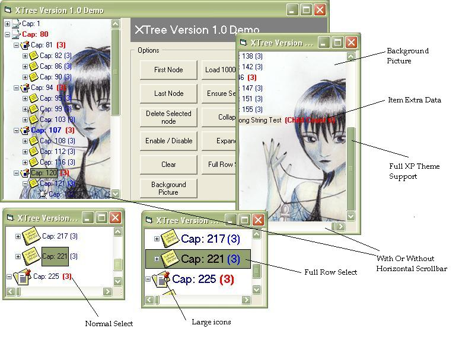



## xTree Custom Tree Control

### Description

A First On PSC (I Think)

An Attempt At A Fully Owner Drawn Treeview Control.

Created To Simulate The Outlook 2003 Treeview Control.

Each Node Can Have It's Own Properties: ie: Fontcolor,Itemdata etc.

Lots Of Properties ie: Gradient Select, Background picture, Background Gradient(Without Picture),Full Row Select, Icons, No Horizontal Scrollbar, XP Theme Support To Many To Mention.

Although This Uses A Collection Based Methodoligy I Think It works Quite Good.

Drawing Is Fast and Flicker Free.

I Have Tested This on Windows XP and Works Really Well Upto 3000 Nodes.

As This Is The First Relase Please Don't Be To Harsh As I Know There Are Many Things Still Missing.

As Always Feedback And Constructive Critisim is Always Welcome.

Kind Regards

Gary
 
### More Info
 

             |
---                |---
**Submitted On**   |2004-10-04 15:17:18
**By**             |[Phantom Man](https://github.com/Planet-Source-Code/PSCIndex/blob/master/ByAuthor/phantom-man.md)
**Level**          |Advanced
**User Rating**    |4.9 (118 globes from 24 users)
**Compatibility**  |VB 6\.0
**Category**       |[Custom Controls/ Forms/  Menus](https://github.com/Planet-Source-Code/PSCIndex/blob/master/ByCategory/custom-controls-forms-menus__1-4.md)
**World**          |[Visual Basic](https://github.com/Planet-Source-Code/PSCIndex/blob/master/ByWorld/visual-basic.md)
**Archive File**   |[xTree\_Cust1801021042004\.zip](https://github.com/Planet-Source-Code/phantom-man-xtree-custom-tree-control__1-56529/archive/master.zip)

